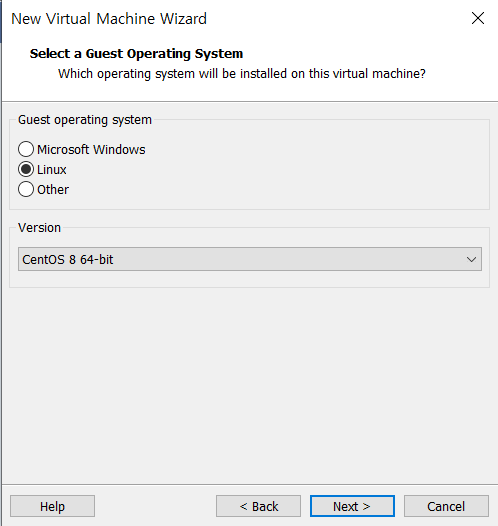
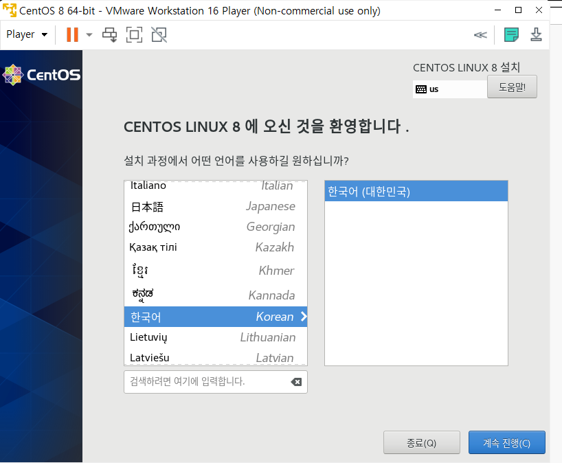
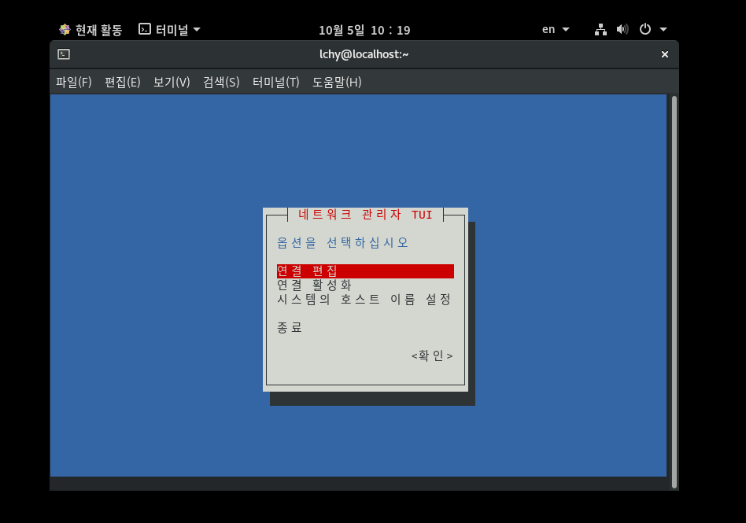
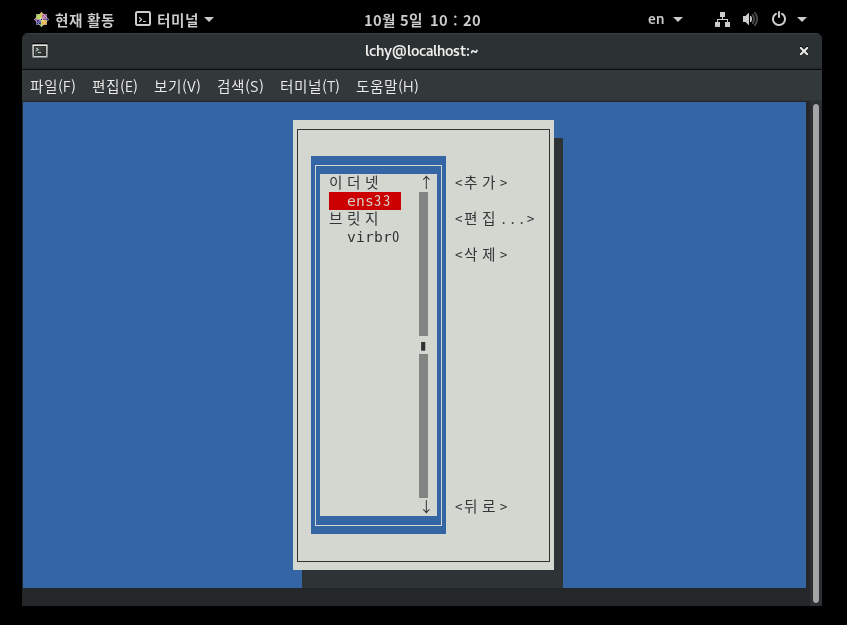
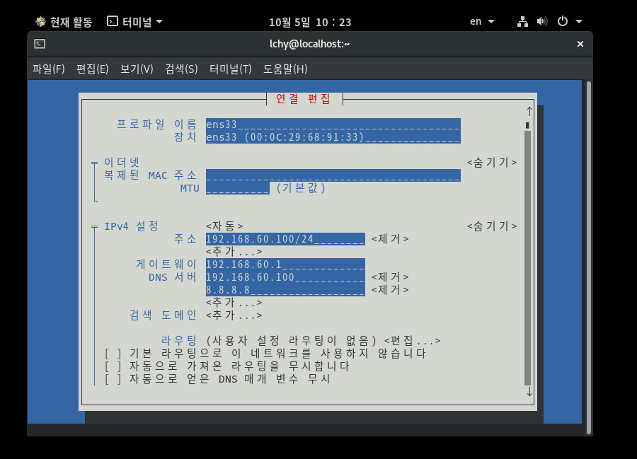
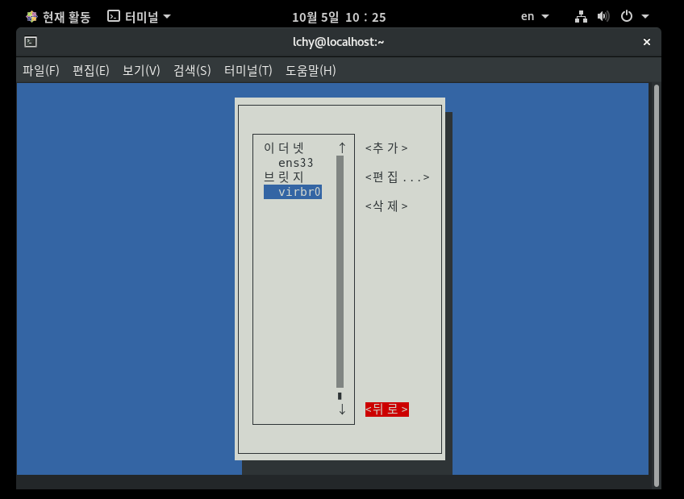

# study_OpenShift
- 쉽게 따라하는 PaaS 구축 가이드(가상화를 이용한 OKD 4 PaaS 구축) 참고하면서 하는 공부

## CentOS란? 
- Red Hat Enterprise Linux를 기반으로한 Linux 배포판이다.
- RHEL(Red Hat 상용 버전 Linux)와 동일 릴리즈에서 각 rpm패키지나 기능, 버그 등이 일치하며 repository정도만 차이가 있다.
- CentOS 8은 이전 버전의 개선 사항을 추가하여 하이브리드 클라우드 아키텍처에 적합한 다양한 도구를 포함하였다.
    - BaseOS repository: OS 기초가 되는 주요 패키지 파일 저장소로 RHEL 릴리즈와 동일한 라이프 사이클을 갖는 RPM 파일이 포함되어 있다. 
    - AppStream: 독자적인 라이프 사이클을 가진 각 애플리케이션을 담은 저장소이다.
    - CentOS 8에서부터 사용되지 않는 기능
        - NFSv3에서 UDP 통신이 가능하지 않다.
        - Network-Scripts가 기본으로 제공되지 않으므로 새로운 ifup/ifdown 명령어를 사용하기 위해서 NetworkManager가 작동되고 있어야 한다.
        - TLS 1.0과 TLS 1.1은 사용할 수 없다.
        - virt-manager가 기본으로 제공되지 않는다.

### VMware에 CentOS 8 설치하기
1. VMware 설치 [https://customerconnect.vmware.com/en/downloads/details?downloadGroup=WKST-PLAYER-1612&productId=1039&rPId=66621]
2. CentOS 8 이미지 설치 [http://mirror.kakao.com/centos/8.4.2105/isos/x86_64/]
3. VMware 실행시키기
4. Create a New Virtual Machine -> Installer disc image file -> 다운받았던 CentOS 8 이미지 선택
5. 다음과 같이 선택
    
6. 계속 해서 Next 눌러주기
7. 검정색 부팅 화면이 나오면 기다리기
8. 다음과 같은 화면 선택하기
    
9. Root 암호와 User-Creation 설정하기

## OKD(OpenShift Origin Community Distribution Kubernetes)
- 몇 대의 machine과 애플리케이션으로 이루어진 소규모 데이터 센터가 수 백만 클라이언트를 지원할 수 있는 수 천대 규모의 데이터센터로 확장 가능하도록 설계도있다.
- 단일 클라우드뿐만 아니라 온프레미스 몇 다중 클라우드 환경까지 컨테이너화된 애플리케이션을 확장, 배포 실행할 수 있다.

### OKD 아키텍쳐
- Kubelet: 클러스터 API에 제공되는 선언 또는 작업을 수행하기 위해 각 node에 실행되는 에어전트이다.
- Kube-proxy: kube-proxy 인스턴스는 클러스터의 모든 node에 실행되며, 각 node에서 Kubernetes 네트워크 서비스를 구현한다.
- 컨테이너 런타임: 선택한 컨테이너 런타임 엔진은 Kubernetes 클러스터의 각 node에 배포되어야 한다.
- OKD의 Machine
    - Workder 클러스터: worker node는 Kubernetes 사용자가 요청한 실제 워크로드가 실행되고 관리되는 곳이다.
    - Master 클러스터: Kubernetes 클러스터를 제어하느데 필요한 서비스를 실행한다. 

### Kubernetes
- 컨테이너화된 애프리케이션의 배포, 확장, 관리 등을 자동화하기 위한 오픈 소스 컨테이너 오케스트레이션 엔진이다.
- 컨테이너 워크로드를 시행하려면 하나 이상의 worker node로 시작하면 된다.
- 하나 이상의 master node에서 이러한 worker node의 배포를 관리한다.
- pod라는 배포 단위로 컨테이너를 매핑한다. pod를 사용하면 컨테이너에 추가 메타 데이터가 제공되고, 단일 배포 엔터티에서 여러 컨테이너를 그룹화 할 수 있다.
- 특별한 종류의 Assert를 만든다.
- 장점
    - OS 이점: 컨테이너는 Linux를 기반으로 함으로써, 오픈소스의 혁신성, 신속한 개발 환경이 가져오는 이점을 모두 사용할 수 있다. 
    - 배포 및 확장 이점
        - 애플리케이션의 주요 릴리스 간 롤링 업그레이드를 사용하는 경우, 다운타임 없이 지속적으로 애플리케이션을 개선하고 현재 릴리스와의 호환성을 유지할 수 있다.
- 오픈소스 - OKD는 Kubernetes 이외에도 여러 오픈소스 프로젝트가 통합되어 있다.

### FCOS(Fedora CoreOS)
- OKD control plane 또는 master machine에 대해 유일하게 지원되는 OS이다.
- 모든 클러스터 시스템의 기본 OS로써, Fedora를 OS로 사용하는 computing 시스템(worker 시스템)을 만들 수 있다.
- OKD 4에서 FCOS를 배포하는 방법 2가지
    - OKD 클러스터가 프로비저닝하는 인프라에 클러스터를 설치하면, 설치 중에 FCOS 이미지가 대상 플랫폼에 다운로드되고, FCOS 구성을 제어하는 적절한 ignition 구성 파일이 machine을 배포하는데 사용된다.
    - 사용자가 관리하는 인프라에 클러스터를 설치하는 경우, 설치 설명서에 따라 FCOS 이미지 확보, ignition 구성 파일 생성, ignition 구성 파일을 통한 machine 프로비저닝을 진행해야 한다.
- FCOS 구성 방법
    - OpenStack과 같이 프로비저닝된 인프라로 시작하거나 인프라를 직접 프로비저닝한다.
    - openshift-install를 실행할 떄, install-config.yaml 파일에 자격 증명, 클러스터 이름과 같은 몇 가지 정보를 제공한다.

#### ignition
- FCOS에서 초기 구성 중에 디스크를 조작하는 데 사용하는 유틸리티이다.
- 처음 부팅 할 떄 iginition은 설치 미디어 또는 사용자가 지정한 위체에서 구성을 읽고, 구성을 machine에 적용한다.
- 작동 원리
    - machine 생성 시, ignition config 파일이 필요하게 된다. ignition config 파일은 OKD 설치 프로그램을 통해 만들 수 있으며, ignition의 구성 내용은 install-config.yaml 파일에서 제공하는 정보를 기반으로 만들어진다.

### Operator
- 다른 소프트웨어를 실행하는 작업의 복잡성을 완화하는 소프트웨어이다.
- Kubernetes 환경을 지속적으로 확인하고 현재 상태를 사용하여 실시간으로 의사 결정을 내린다.

## OpenShift 구축하기
- Bastion node 구성
1. 패키지 설치
```
sudo dnf install qemu-kvm -y
qemu-img create -f qcow2 bastion.cent83.lds.co.kr 200G
```
2. Hostname 설정
```
hostnamectl set-hostname bastion,cent83.lds.co.kr
```
3. Network Interface 설정
```
nmtui
```

- '연결 편집' 선택한다.

- 연결 인터페이스(예) ens33) 선택 후 수정한다.

- 네트워크 장비의 주소, 게이트웨이, DNS 주소 설정 후 확인 버튼 선택한다.

- IP 설정 완료 시, 내용 적용을 위해 이전 메뉴로 돌아간다.

- 연결 활성화를 클릭한다.

- 활성화를 하여 설정한 내역을 적용시킨다.

4. 내부 DNS 구성
```
sudo yum -y install bind bind-utils
```
    - 파일 수정 `sudo nano /etc/named.conf `
```
zone "." IN {
	type hint;
        file "named.ca";
};

zone "cent83.lds.co.kr." IN {
        type master;
        file "cent83.lds.co.kr.zone";

};

zone "60.168.192.in-addr.arpa." IN {
        type master;
        file "cent83.lds.co.kr.rev.zone";
}
```
5. DNS 방화벽 설정
```
firewall-cmd --add-service=dns --permanent
firewall-cmd --reload
```
6. DNS 서비스 시작
```
systemctl enable named
systemctl start named
```
7. haproxy 설치
```
sudo dnf install haproxy -y
```
    - 파일 수정 `sudo nano /etc/haproxy/haproxy.cfg` 

```
frontend openshift-api-server
    bind *:6443
    default_backend openshift-api-server
    mode tcp
    option tcplog

backend openshift-api-server
    balance source
    mode tcp
    server bootstrap 192.168.60.10:6443 check
    server master1 192.168.6.20:6443 check
    server master2 192.168.6.30:6443 check
    server master3 192.168.6.40:6443 check

frontend machine-config-server
    bind *:222623
    default_backend machine-config-server
    mode tcp option tcplog

backend machine-config-server
    balance source
    mode tcp
    server bootstrap 192.168.60.10:22623 check
    server master1 192.168.60.10:22623 check
    server master2 192.168.60.10:22623 check
    server master3 192.168.60.10:22623 check

frontend ingress-ttp
    bind *:80
    default_backend ingress-http
    mode tcp
    option tcplog

backend ingress-http
    balance source
    mode tcp
    server master1 192.168.60.20:80 check
    server master2 192.168.60.30:80 check
    server master3 192.168.60.40:80 check

frontend ingress-https
    bind *:443
    default_backend ingress-https
    mode tcp
    option tcplog

backend ingress-https
    balance source
    mode tcp
    server master1 192.168.60.20:443 check
    server master2 192.168.60.20:443 check
    server master3 192.168.60.20:443 check
```
8. haproxy 설정
```
firewall-cmd --permanent --add-port=22623/tcp
firewall-cmd --reload

sudo setsebool -P haproxy_connect_any 1

systemctl enable haproxy

systemctl start haproxy
```
9. http file 서버 설정
```
sudo dnf install httpd -y
```
    - 포트 변경 `sudo nano /etc/httpd/conf/httpd.conf`
    ```
    Listen 8080
    ```
```
systemctl enable httpd.service
systemctl start httpd
firewall-cmd --add-port=8080/tcp --permanent
firewall-cmd --reload
```
10. 키생성
```
ssh-keygen
```
11. linux openshift-installer 다운
```
sudo wget https://github.com/openshift/okd/releases/download/4.8.0-0.okd-2021-10-01-221835/openshift-client-linux-4.8.0-0.okd-2021-10-01-221835.tar.gz
sudo wget https://github.com/openshift/okd/releases/download/4.8.0-0.okd-2021-10-01-221835/openshift-install-linux-4.8.0-0.okd-2021-10-01-221835.tar.gz

sudo tar zxvf openshift-client-linux-4.8.0-0.okd-2021-10-01-221835.tar.gz 
sudo tar zxvf openshift-install-linux-4.8.0-0.okd-2021-10-01-221835.tar.gz 

echo $PATH

sudo mv oc /bin
sudo mv openshift-install /bin
sudo mv kubectl /bin
```
12. Install Config 생성
```
sudo mkdir /var/www/html/okd46
```
- config 파일 생성 `sudo nano install-config.yaml`
```
apiVersion: v1
baseDomain: example.com 
compute:
- hyperthreading: Enabled   
  name: worker
  replicas: 0 
controlPlane:
  hyperthreading: Enabled   
  name: master 
  replicas: 3 
metadata:
  name: test 
networking:
  clusterNetwork:
  - cidr: 10.128.0.0/14 
    hostPrefix: 23 
  networkType: OpenShiftSDN
  serviceNetwork: 
  - 172.30.0.0/16
platform:
  none: {} 
fips: false 
pullSecret: '{"auths":{"fake":{"auth":"bar"}}}' 
sshKey: 'SHA256 cAudnfnCtnDrijsLd3vKTcvC6JVN8vE8kFgzNUCFRIA' 
```
- kubernetes manifests 및 Ignition 파일 구성
```
sudo cp ./install-config.yaml /var/www/html/okd46
sudo openshift-install create manifests --dir=/var/www/html/okd46
```